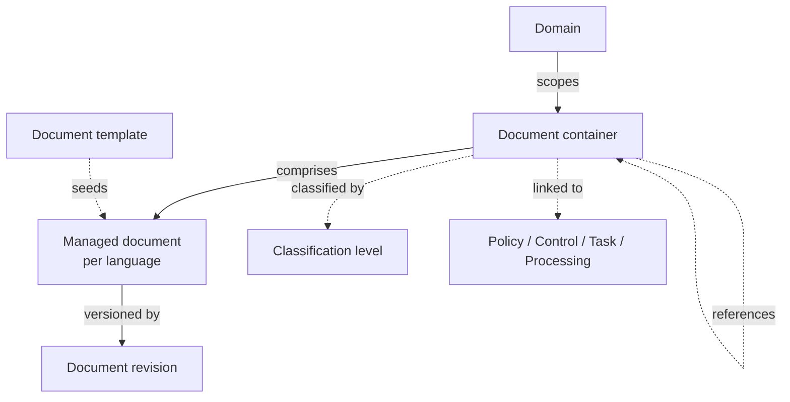

# Documents

**Document management** lets you author, version, and publish documents — policies, procedures, charters, records, meeting minutes — directly inside CISO Assistant, so the text of your governance programme lives where the rest of your GRC data lives, with revision history and an approval workflow attached.

Documents can be **authored in-platform** (a Markdown editor with a draft → published lifecycle), **uploaded** (an existing PDF or file carried through the same lifecycle), or **linked** (a pointer to a document that lives in another system). Whatever the source, a document can be classified, linked to the objects it governs, and referenced by other documents.


Document management is controlled by the `document_management` [feature flag](../configuration/settings/feature-flags.md) (on by default). The **Documents** reading catalogue, the document list, and templates all live behind it.


## Mental model

A **document container** is the language-independent identity of a document: it holds the document's type, its domain, its classification, and its links. Under it sit one **managed document** per language, and each managed document is a chain of **document revisions** — one per saved increment. A new document can be **seeded** from a template, **classified** with a level, **reference** other containers, and be **linked to** the objects it governs. Solid edges are always present; dashed edges are optional.

| In the UI | Internally |
| --- | --- |
| Document | `DocumentContainer` |
| Language version | `ManagedDocument` |
| Revision | `DocumentRevision` |
| Document template | `DocumentTemplate` |

## Document types

Every document has a **Document type**, used to group the reading catalogue and to scope the template picker. The built-in types are **Policy**, **Procedure**, **Charter**, **Record**, **Meeting minutes**, and **Other**.

## Content sources

A document's content comes from one of three sources, chosen when you create it:

- **Authored** — written in the in-platform Markdown editor (formatting toolbar, live preview, insert links to other documents). The published version is rendered to a PDF snapshot.
- **Uploaded** — an existing file (e.g. a signed PDF) attached to the document. It runs through the same lifecycle and version history, but is served as-is rather than rendered from Markdown.
- **Linked** — a pointer to a document that lives in another system (Confluence, SharePoint, a DMS, …). The document carries the URL through the same lifecycle; readers open it in place rather than reading content inside CISO Assistant.

All three share the same versioning, lifecycle, languages, classification, and links — they differ only in where the content lives.

## Lifecycle and versioning

Each language version moves through its own lifecycle — **Draft → In review → Change requested → Validated → Published → Deprecated** — and every saved change produces a new revision (`v1`, `v2`, …) rather than overwriting the previous text. The **Version history** sidebar lets you read any past revision and diff two of them.

The lifecycle, revision history, and diff mechanics are shared with policy documents and are described in detail under [Policies → Versioning, history, and diff](policies.md#versioning-history-and-diff).

## Multiple languages

A single document can carry a version per language. One language is the **default** (used for the catalogue title and status); the others are translations. Each language version has its own lifecycle, so a French translation can still be in draft while the English original is published.

## References

When you link one document to another from inside the editor (**Link to document**), CISO Assistant records the edge automatically. Each document then shows:

- **References** — the documents this one points to.
- **Referenced by** — the documents that point at this one.

These are computed from the content — there is no separate list to maintain, and they stay accurate as the text changes.

## Links to governed objects

A document can be linked to one or more **Policies**, **Applied controls**, **Task definitions**, or **Processings**. The link is associative — it never changes the document's domain or publication state — and it is bi-directional: the linked object shows a **Documents** panel listing the documents attached to it.

This is how a policy or a control points at the document that describes it without duplicating the text. See [Policies → Authoring options](policies.md#authoring-options).

## Classification

A document can carry a **Classification** — a level from an [object classification](object-classification.md) scheme such as TLP. Once set, the level shows as a coloured badge on the reading catalogue, in the reader, and in the documents table, and it is stamped on every page of the document's exported PDF (for example `TLP:AMBER`). Classification is optional and independent of the document's type, domain, and lifecycle.

## Templates

New authored documents can start from a **document template** — a reusable Markdown body, chosen in the editor's template picker. The picker only offers templates matching the document's type and language. See the [Document templates guide](../guides/documents/document-templates.md).

## Reading catalogue

The **Documents** page is a read-oriented catalogue: published documents shown as tiles, grouped by type, with search and type filters. It is the place to browse and read the published corpus, separate from the authoring workflow.

## Related

- [Authoring documents](../guides/documents/authoring-documents.md)
- [Document templates](../guides/documents/document-templates.md)
- [Policies](policies.md)
- [Feature flags](../configuration/settings/feature-flags.md)
