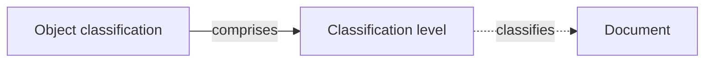

# Object classifications

An **object classification** is a scheme that marks how sensitive an object is — think **TLP** (Traffic Light Protocol), or a custom scale aligned to a customer's or an authority's own tiers. Each scheme is an ordered set of **levels**, and any object that supports classification can be tagged with one of them.

CISO Assistant ships with **TLP** built in, and lets you tune it or define your own schemes alongside it.

## Why it exists

Organisations exchange documents with customers, partners, and authorities that each impose their own sensitivity tiers. One party works in TLP; another in a national CONFIDENTIAL / SECRET scale; a customer in its own bespoke levels. Object classifications let you define those schemes once and apply them consistently, with colour coding people already recognise.

## Mental model

A **scheme comprises an ordered set of levels**. Each level carries a **rank** (its position in the order, from least to most sensitive), a **colour**, an **abbreviation**, and a translatable name and description. A level can then **classify** an object — today, a **document** — which surfaces it as a coloured badge and, on published PDFs, a page marking. The dashed edge is deliberate: classifying an object is always optional.

## How it works

A scheme is a thin container with a name and an **ID** (`TLP`, for example). Its meaning lives in its **levels**, which are ordered by **rank**:

- **Rank** sets the order and carries semantic weight — a higher rank is more sensitive. TLP runs `CLEAR < GREEN < AMBER < AMBER+STRICT < RED`.
- **Colour** is the swatch shown wherever the level appears; the platform picks readable text automatically over it.
- **Abbreviation** is the short token on the badge (`AMBER`, `RED`).
- **Name** and **description** are translatable, so a level reads in the user's language.

The built-in **TLP** scheme follows the FIRST TLP 2.0 standard — five levels with their official colours. Its structure is protected: you can hide levels you don't use, but you can't delete or reorder the canonical set.

## Ordering carries meaning

Because levels are ranked rather than just listed, the order is data, not decoration — "at least AMBER" is a well-defined comparison. Today a classification is a **visual marking**; the ordinal rank is the foundation for comparing and, in future, gating access by level.


Classification is currently cosmetic — a badge and a document marking. The rank is designed so that a later access-control layer can treat a clearance as granting every lower level, without reworking the data.


## Customising a scheme

Open a scheme to reach its level editor, where you can:

- **Add** a custom level with **Add level** — set its abbreviation, name, and colour; it slots in at the end of the order.
- **Reorder** levels with the up/down controls (rank follows the order).
- **Hide** a level with its visibility toggle — it stops being offered without being destroyed.
- **Edit** or **delete** custom levels.

Built-in levels (and the built-in TLP scheme itself) can only be **hidden**, never deleted or restructured — so the canonical TLP always stays intact, and a hidden level stays hidden across restarts.

## Applying a classification to a document

When you create or edit a document, the **Classification** field lets you pick a level. Once set, the level shows as a coloured badge on the document catalog, in the reader, and in the documents table, and it is stamped on every page of the document's exported PDF (for example `TLP:AMBER`, in the level's colour). Deleting a level a document points at simply clears the field — the document is never removed.

Documents are the first object type to carry a classification; the same mechanism extends to other objects over time.

## Scoping

Schemes and their levels live in the global (root) folder — they apply organisation-wide. Multiple schemes can coexist, so TLP and a customer-specific scheme are both available at once.

## Where you find it

In the sidebar under **Extra → Object classifications**. The list shows every scheme; open one to manage its levels. Access is governed by the standard permissions — viewing is available to every role, while creating and editing schemes and levels is reserved for administrators.

## Related

- [Documents](documents.md) — the first object type that carries a classification
- [Terminology](terminology.md) — a related organisation-defined override layer
