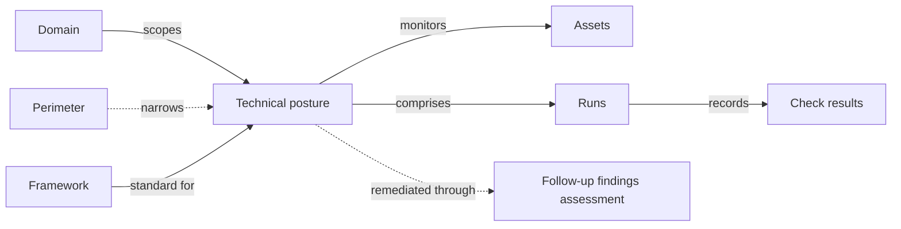

# Technical postures

A **technical posture** measures a fleet of assets against a technical baseline — a CIS Benchmark, a hardening guide, or any check-shaped framework — and keeps the measurements coming. Where an audit captures a considered, point-in-time evaluation, a technical posture is a living scoreboard: scanners, scripts, and operators keep pushing results, and the platform always shows the latest state of every check on every asset.


Technical postures are gated by the `posture_assessments` feature flag. Default off. See [Feature flags](../configuration/settings/feature-flags.md).


## Mental model

A technical posture always lives inside a **domain** and is measured against one **framework**, whose assessable requirements act as the check list. It monitors a set of **assets**, and every ingestion of results — a manual entry session, an API push, a file import — is recorded as a **run** carrying one **check result** per (check, asset) it touched. An optional **follow-up findings assessment** is where remediation of failing checks is tracked.

| User-facing | Internal | Notes |
|---|---|---|
| Technical posture | `PostureAssessment` | One framework × one domain × a set of assets |
| Run | `PostureRun` | One ingestion event; keeps the tool name and start time |
| Check result | `PostureResult` | One measurement of one check on one asset |
| Check | `RequirementNode` | Assessable requirement from the framework library |
| Follow-up assessment | `FindingsAssessment` | Findings assessment with the "Posture follow-up" category |
| Domain | `Folder` | Required; drives IAM scoping |

## The measurement cube

Think of a technical posture as a three-dimensional cube of measurements:

- **Checks** — the assessable requirements of the chosen framework. If the framework defines implementation groups (for example _Automated_ vs _Manual_ recommendations in a CIS Benchmark), the **Selected implementation groups** field narrows the check list to the slice you committed to.
- **Assets** — the fleet under measurement. Assets can be enrolled explicitly, or automatically the first time results arrive for them.
- **History** — for each (check, asset) cell, the platform keeps the last N results, where N is the **History depth** of the assessment (10 by default). Older results are pruned as new ones arrive.

The cube is **sparse** on purpose: nothing is created upfront. A cell only exists once something has measured it, and the **Measured checks** read-out tells you how much of the cube is filled. The **current posture** — what the overview, the score, and the action plan are computed from — is simply the latest result in each cell.

Each result carries one of five values: **Pass**, **Fail**, **Not applicable**, **Error**, or **Not checked**, along with the observed and expected values and a message when the source provides them. The **Pass rate** score is computed over Pass and Fail only — errors and unchecked cells don't dilute it.

## Lightweight by design

Technical postures deliberately do **less** than [audits](audits.md):

| | Audit | Technical posture |
|---|---|---|
| Question answered | "Are we compliant, and can we prove it?" | "What is passing right now, and what changed?" |
| Rows | One requirement assessment per requirement, created upfront | Sparse — only measured cells exist |
| Result | Compliance result, score, maturity — set by a person | Pass/fail vocabulary — set by whatever measured it |
| Substantiation | Evidences and applied controls per requirement | Observed vs expected values from the measurement |
| Cadence | Campaign or review cycle | Continuous — every scan is a new run |

The two share the same framework catalogue, so a benchmark imported once can back both a formal audit and a running posture. Use an audit when a human needs to weigh evidence and sign off; use a technical posture when a tool can answer the question and you want it answered often.

## Runs

Every way of getting results in produces a run:

- **Manual runs** — the "New manual run" flow on the Runs tab, or per-asset editing in the tree view, for checks a human performs.
- **API** — scanners push JSON to the assessment's `upload-results` endpoint; re-using the returned run identifier accumulates or patches the same run. The API tab shows a ready-to-copy example.
- **File import** — the "Import results" button on the Runs tab accepts CSV and XLSX files as well as OCSF Compliance Finding JSON. A mapping dialog lets you bind arbitrary scanner CSV columns and result values, choose how colliding rows aggregate, and target one or several of the scoped assets.

Runs are the ingestion log of the assessment: the Runs tab lists them with their tool, check counts, and pass/fail breakdown, and a run's detail page shows exactly what it recorded per asset. The trend chart on the Overview tab plots the pass rate across runs, which is how posture drift becomes visible.

## Findings and remediation

The **Action plan** tab lists every check whose current result is anything other than Pass — failures first, then errors, then unchecked and not-applicable cells — so the operational team can decide what to investigate. From there, each line can be turned into a **finding** with one click.

Findings do not live on the technical posture itself. They are created in the **follow-up assessment**, a regular findings assessment linked to the posture (the creation form offers to create one automatically via **Create a related findings assessment**). This separation is deliberate:

- **Measurements are ephemeral; remediation is not.** A check result is overwritten by the next run and eventually pruned by the history depth. A finding needs a stable life of its own — status, owner, ETA, severity, linked applied controls — that survives every re-measurement. Pinning remediation to a measurement row would lose it on the next scan.
- **Remediation is a shared discipline.** Findings assessments are the platform's common remediation ledger — the same object used for pentest reports and internal reviews. Routing posture failures into one means they benefit from the full findings workflow (action plans, applied controls, reporting) instead of a parallel, posture-only mechanism.
- **The posture stays a pure measurement surface.** The cube tells you *what is true right now*; the follow-up assessment tells you *what you are doing about it*. Either can be read — or rebuilt — without touching the other.

The link is kept visible in both directions: the action plan shows the finding attached to each failing check with its status and ETA, and re-measuring a remediated check back to Pass is how the fix is verified — on the next run, not by declaration.
