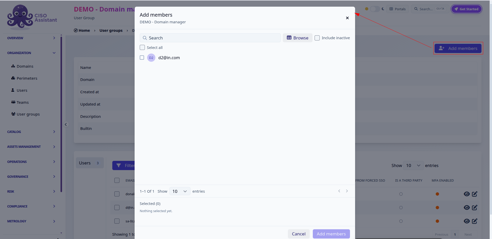
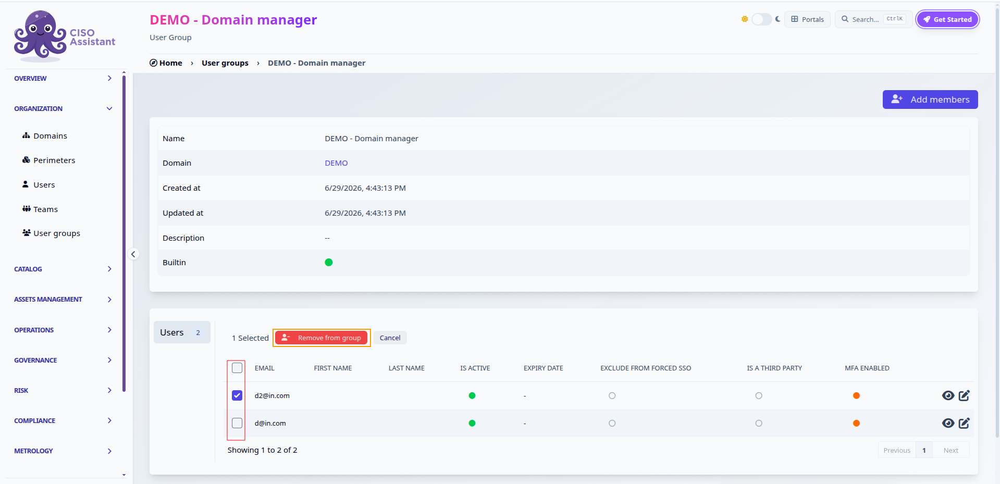

# User Groups

For now, it is not possible to create custom role assignments so you need to use built-in user groups. They are linking a domain with a role which contains precise permissions, that will be given to users in this group.

### Roles

Let's give some details on the 5 built-in roles:

| Role           | Permissions                                                                                                                       |
| -------------- | --------------------------------------------------------------------------------------------------------------------------------- |
| Administrator  | full access (except approval), and specifically management of domains, users and users rights                                     |
| Domain manager | full access to selected domains (except approval), in particular managing rights for these domains. Read access to global objects |
| Analyst        | read-write access to selected perimeters/domains. Read access to global and domain objects                                        |
| Reader         | read access to selected perimeters/domains                                                                                        |
| Approver       | like reader, but with additional capability to approve risk acceptances                                                           |
| Respondent     | see [assignments.md](../../features/assignments.md "mention") for more details                                                    |


Django superuser is given administrator rights automatically on startup.


### Global user groups

Once your instance is created, five user groups are already present:

* Global - Administrator
* Global - Analyst
* Global - Reader
* Global - Approver
* Global - Respondent

They give corresponding permissions on Global scope so on every object of your instance.

### Domain user groups

They are created for each domain you add. For example, if you create a domain _R\&D_, there will be:

* R\&D - Domain Manager
* R\&D - Analyst
* R\&D - Reader
* R\&D - Approver
* R\&D - Respondent

They give corresponding permissions on the domain scope so on every object inside _R\&D_.

### Managing group members

You can manage the members of a user group directly from the group's detail page. This is available to administrators, and to domain managers for the groups of their own domains: membership is governed by the *change user group* permission on the group's domain, so a domain manager can add or remove members without needing global user-management rights.

#### Adding members

Open the user group and click **Add members**. A picker opens listing the users that are not yet in the group:

* type in the search field to filter by email, first name or last name, or switch to **Browse** for a table view with per-column filters;
* tick **Include inactive** to also list deactivated users;
* your selection is kept while you search and change pages, and is summarised at the bottom of the picker;
* click **Add members** to confirm.

<figure><figcaption>
Adding members to a domain user group
</figcaption></figure>

#### Removing members

On the group's **Users** tab, tick the members to remove, then click **Remove from group**:

<figure><figcaption>
Removing selected members from a user group
</figcaption></figure>


Two safeguards apply: the last member of the *Global - Administrator* group can never be removed, and domain managers cannot remove themselves from a domain administrator group — another administrator has to do it.

